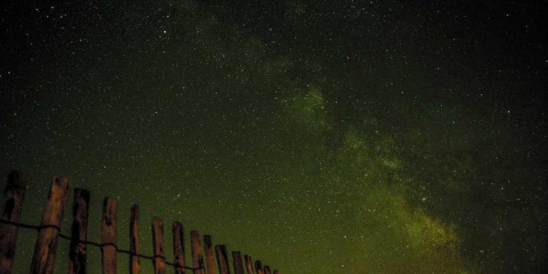
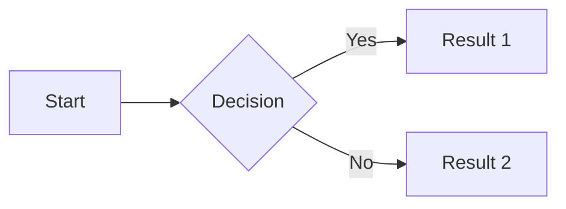

# Example Documentation

This is an example documentation to test Markdown syntax supported by Docsify.

## Paragraphs and Line Breaks

This is a paragraph.
This is a line break.

There is an empty line between paragraphs.

## Emphasis

_Italic text_

**Bold text**

**_Both italic and bold_**

~~Strikethrough~~

==Highlight==

## Lists

### Unordered List

- Item 1
- Item 2
  - Subitem 1
  - Subitem 2

### Ordered List

1. First item
2. Second item
3. Third item
   1. Subitem 1
   2. Subitem 2

## Links and Images

[This is a link](https://www.example.com "Link title")



## Blockquotes

> This is a blockquote.
> It can contain multiple paragraphs.

## Code

`print("Hello, World!")`

```json
{
  "id": "87584d77-4c7f-4873-b94a-d29527fc6524",
  "type": "example"
}
```

## Tables

| Header 1 | Header 2 | Header 3 |
| -------- | -------- | -------- |
| Cell 1   | Cell 2   | Cell 3   |
| Cell 4   | Cell 5   | Cell 6   |

### Table Alignment

| Left-aligned | Center-aligned | Right-aligned |
| :----------- | :------------: | ------------: |
| Cell         |      Cell      |          Cell |
| Cell         |      Cell      |          Cell |

## Task Lists

- [x] Completed item
- [ ] Uncompleted item

## Horizontal Rules

---

---

---

## Footnotes

This is a footnote example [^1].

## HTML

<div>This is an HTML element</div>

## Escaping Special Characters

\* Asterisk\*

## Mermaid

### Flowchart



## Collapsible Content

<details>
  <summary>Click to expand/collapse</summary>
  This is collapsible content...
</details>

## Mathematical Formulas

$$
E=mc^2
$$

## Alert Boxes

> [!INFO] This is an alert box
> Here's a callout block.

## Other Elements — abbr, sub, sup, kbd, mark

<abbr title="Graphics Interchange Format">GIF</abbr> is a bitmap image format.

H<sub>2</sub>O

X<sup>n</sup> + Y<sup>n</sup> = Z<sup>n</sup>

Press <kbd>CTRL</kbd>+<kbd>ALT</kbd>+<kbd>Delete</kbd> to end the session.

Most <mark>salamanders</mark> are nocturnal and hunt for insects, worms, and other small creatures.

[^1]: This is the footnote content.
