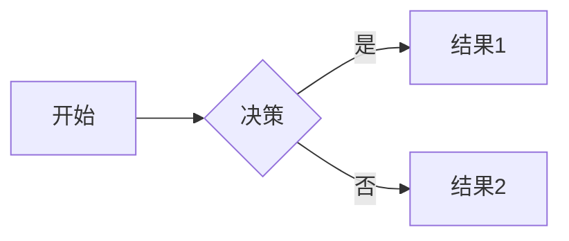

# 示例文档

这是一个示例文档，测试 Docsify 支持的 Markdown 语法。

## 段落和换行

这是一个段落。
这是一个换行。

段落之间有一个空行。

## 强调

_斜体文本_

**粗体文本**

**_同时斜体和粗体_**

~~删除线~~

==高亮==

## 列表

### 无序列表

- 项目 1
- 项目 2
  - 子项目 1
  - 子项目 2

### 有序列表

1. 第一项
2. 第二项
3. 第三项
   1. 子项 1
   2. 子项 2

## 链接和图片

[这是一个链接](https://www.example.com "链接标题")


## 引用

> 这是一个引用。
> 可以包含多个段落。

## 代码

`print("Hello, World!")`

```json
{
  "id": "87584d77-4c7f-4873-b94a-d29527fc6524",
  "type": "example"
}
```

## 表格

| 表头 1   | 表头 2   | 表头 3   |
| -------- | -------- | -------- |
| 单元格 1 | 单元格 2 | 单元格 3 |
| 单元格 4 | 单元格 5 | 单元格 6 |

### 表格扩展用法

| 左对齐 |  居中  | 右对齐 |
| :----- | :----: | -----: |
| 单元格 | 单元格 | 单元格 |
| 单元格 | 单元格 | 单元格 |

## 任务列表

- [x] 已完成项
- [ ] 未完成项

## 分隔线

---

---

---

## 脚注

这是一个脚注的例子 [^1]。

## HTML

<div>这是一个 HTML 元素</div>

## 特殊符号的转义

\* 星号\*

## Mermaid

### 流程图



## 折叠内容

<details>
  <summary>点击展开/折叠</summary>
  这里是可以被折叠的内容…
</details>

## 数学公式

$$
E=mc^2
$$

## 提示框

> [!INFO] 这是一个提示框
> Here's a callout block.

## 其他元素 — abbr, sub, sup, kbd, mark

<abbr title="Graphics Interchange Format">GIF</abbr> 是一种位图图像格式。

H<sub>2</sub>O

X<sup>n</sup> + Y<sup>n</sup> = Z<sup>n</sup>

按下 <kbd>CTRL</kbd>+<kbd>ALT</kbd>+<kbd>Delete</kbd> 结束会话。

大多数 <mark>蝾螈</mark> 是夜行动物，捕食昆虫、蠕虫和其他小生物。

[^1]: 这是脚注的内容。
